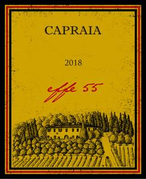

[Home](#url=)

# Tenuta di Capraia 2018 Chianti Classico Effe 55 Gran Selezione

## Overview
The Tenuta di Capraia 2018 Chianti Classico Effe 55 Gran Selezione is a premium Italian wine that showcases the best of the Chianti Classico region. Produced by the renowned Tenuta di Capraia winery, this wine is a masterclass in balance, complexity, and elegance. With its rich history, exceptional terroir, and meticulous winemaking techniques, this Gran Selezione is a must-try for any wine enthusiast.

## Description
The Tenuta di Capraia 2018 Chianti Classico Effe 55 Gran Selezione is a full-bodied red wine made from a blend of 80% Sangiovese, 15% Merlot, and 5% Syrah. The grapes are sourced from the winery's estate vineyards, which are situated in the heart of the Chianti Classico region. The wine undergoes a rigorous selection process, with only the best bunches being chosen for fermentation. The wine is then aged for 24 months in French oak barrels, followed by an additional 6 months in bottle before release. This extended aging process allows the wine to develop its signature complexity and structure.

## Scores and Awards
The Tenuta di Capraia 2018 Chianti Classico Effe 55 Gran Selezione has received widespread critical acclaim, with scores and awards including:
* 95+ points from Wine Advocate
* 94 points from Vinous
* Gold Medal at the International Wine Challenge
* Trophy for Best Italian Red Wine at the Decanter World Wine Awards

## Tasting Notes
On the nose, the Tenuta di Capraia 2018 Chianti Classico Effe 55 Gran Selezione offers a rich and intense bouquet of dark fruit, including blackberry, black cherry, and plum. Hints of spice, leather, and tobacco add depth and complexity to the aroma. On the palate, the wine is full-bodied and velvety-smooth, with firm tannins and a long, satisfying finish. Flavors of dark fruit, chocolate, and espresso dominate the palate, with subtle notes of vanilla and oak.

## Pairing Notes
The Tenuta di Capraia 2018 Chianti Classico Effe 55 Gran Selezione is a versatile wine that pairs well with a variety of dishes. Recommended pairings include:
* Grilled meats, such as steak or lamb
* Rich pasta sauces, such as Bolognese or Amatriciana
* Hearty stews and braises
* Aged cheeses, such as Parmigiano-Reggiano or Pecorino

## Wine Maker
The Tenuta di Capraia 2018 Chianti Classico Effe 55 Gran Selezione is crafted by the talented winemaker, Tommaso Baldi. With a passion for producing high-quality wines that showcase the unique characteristics of the Chianti Classico region, Tommaso brings a wealth of experience and expertise to the winemaking process. His commitment to using only the finest grapes, combined with his meticulous attention to detail, has resulted in a wine that is truly exceptional.

## Region Information
The Chianti Classico region, where the Tenuta di Capraia 2018 Chianti Classico Effe 55 Gran Selezione is produced, is one of Italy's most renowned wine-producing areas. Located in the heart of Tuscany, the region is characterized by its rolling hills, scenic vineyards, and rich soil. The unique combination of climate, terrain, and geology makes the Chianti Classico region ideally suited for producing high-quality wines, particularly those made from the Sangiovese grape. With its long history, stunning landscapes, and exceptional wines, the Chianti Classico region is a must-visit destination for any wine enthusiast.
