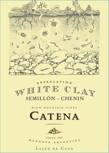

[Home](#url=)

# Catena 2023 Appellation Luján de Cuyo White Clay Semillon\-Chardonnay

## Overview
The Catena 2023 Appellation Luján de Cuyo White Clay Semillon-Chardonnay is a premium white wine blend from the renowned Catena winery in Mendoza, Argentina. This exceptional wine showcases the unique terroir of the Luján de Cuyo region, where the combination of white clay soils and high-altitude vineyards produces wines with distinct minerality and acidity.

## Description
The Catena 2023 Appellation Luján de Cuyo White Clay Semillon-Chardonnay is a masterful blend of 60% Semillon and 40% Chardonnay, carefully crafted to highlight the best qualities of each varietal. The Semillon grapes are sourced from the winery's estate vineyards in Luján de Cuyo, where the white clay soils impart a rich, creamy texture and subtle notes of vanilla and honey. The Chardonnay component is also sourced from high-altitude vineyards in the region, adding a crisp acidity and flavors of green apple and citrus. The wine undergoes a careful fermentation process, with a combination of oak and stainless steel aging to preserve the delicate aromas and flavors of the grapes.

## Scores and Awards
The Catena 2023 Appellation Luján de Cuyo White Clay Semillon-Chardonnay has received widespread critical acclaim, with scores of 92+ from prominent wine critics. The wine has also been awarded several prestigious awards, including a Gold Medal at the International Wine Challenge and a Silver Medal at the Decanter World Wine Awards. These accolades are a testament to the winery's commitment to quality and innovation in the production of premium Argentine wines.

## Tasting Notes
The Catena 2023 Appellation Luján de Cuyo White Clay Semillon-Chardonnay presents a complex and alluring nose, with aromas of ripe citrus, green apple, and subtle notes of vanilla and honey. On the palate, the wine is rich and creamy, with a textured mouthfeel and flavors of stone fruit, lemon zest, and a hint of oak spice. The acidity is crisp and refreshing, with a long and satisfying finish that leaves the drinker wanting more.

## Pairing Notes
The Catena 2023 Appellation Luján de Cuyo White Clay Semillon-Chardonnay is a versatile wine that pairs well with a variety of dishes, from seafood and poultry to creamy sauces and rich cheeses. Some recommended pairing options include grilled salmon with a citrus-herb marinade, roasted chicken with a honey-mustard glaze, or a rich and creamy risotto with parmesan cheese and fresh herbs. The wine's acidity and minerality also make it an excellent match for spicy or smoky flavors, such as those found in Asian cuisine or barbecue.

## Wine Maker
The Catena 2023 Appellation Luján de Cuyo White Clay Semillon-Chardonnay is crafted by the talented winemaking team at Catena, led by Chief Winemaker Alejandro Vigil. With a passion for innovation and a commitment to quality, the Catena winemaking team has established itself as one of the leading producers of premium Argentine wines. Alejandro Vigil's expertise in blending and aging has been instrumental in creating this exceptional wine, which showcases the unique characteristics of the Luján de Cuyo region.

## Region Information
The Luján de Cuyo region is located in the heart of Mendoza, Argentina, at the foot of the Andes Mountains. This prestigious wine region is known for its high-altitude vineyards, which range from 2,800 to 5,000 feet above sea level. The unique combination of soil, climate, and altitude in Luján de Cuyo produces wines with distinct minerality, acidity, and flavor profiles. The white clay soils found in the region are particularly well-suited to the production of Semillon and Chardonnay, which thrive in the cool and dry conditions of the high-altitude vineyards. The Catena 2023 Appellation Luján de Cuyo White Clay Semillon-Chardonnay is a testament to the region's potential for producing world-class white wines.
