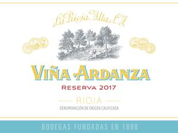

[Home](#url=)

# La Rioja Alta 2017 Viña Ardanza Reserva

## Overview
La Rioja Alta 2017 Viña Ardanza Reserva is a renowned Spanish red wine that embodies the rich traditions and expertise of La Rioja Alta, one of Spain's most prestigious wineries. This wine is a testament to the region's ability to produce high-quality wines with distinct character and aging potential.

## Description
The La Rioja Alta 2017 Viña Ardanza Reserva is crafted from a blend of Tempranillo (80%) and Garnacha (20%), showcasing the perfect harmony between these two varietals. The grapes are carefully selected from the winery's own vineyards in the Rioja Alta region, where the unique terroir and meticulous viticulture practices ensure optimal ripeness and flavor development. Following a traditional vinification process, the wine undergoes aging in American oak barrels for 36 months, which contributes to its complex aroma profile and smooth, velvety texture.

## Scores and Awards
This exceptional wine has garnered significant recognition from esteemed critics and competitions worldwide. The La Rioja Alta 2017 Viña Ardanza Reserva has been awarded a score of 94 points by Wine Advocate, with other notable ratings including 93 points from Wine Enthusiast and 92 points from Vinous. Additionally, it has received several awards at international wine competitions, solidifying its position as one of the top wines in its category.

## Tasting Notes
Upon tasting, the La Rioja Alta 2017 Viña Ardanza Reserva presents an alluring bouquet of dark fruit, including blackberry and black cherry, complemented by subtle hints of vanilla, leather, and tobacco. The palate is rich and full-bodied, with flavors of ripe plum, raspberry, and a touch of spice, supported by firm tannins that add structure and depth to the wine. As it evolves in the glass, the wine reveals its complexity and aging potential, making it an excellent choice for both immediate enjoyment and long-term cellaring.

## Pairing Notes
The La Rioja Alta 2017 Viña Ardanza Reserva is a versatile wine that can be paired with a variety of dishes to enhance their flavors. Recommended pairings include traditional Spanish cuisine such as tapas, paella, and grilled meats like chorizo and morcilla. It also complements rich game meats, roasted lamb, and mature cheeses, making it an excellent addition to any dining experience.

## Wine Maker
The La Rioja Alta winery has been family-owned since its founding in 1890, with a strong commitment to preserving traditional winemaking techniques while incorporating modern innovations. The current winemaker, Julio Sáenz, continues this legacy by overseeing the production of Viña Ardanza Reserva and other wines, ensuring that each bottle meets the high standards of quality and excellence that have come to define La Rioja Alta.

## Region Information
The Rioja region in northern Spain is renowned for its unique terroir and climate, which provide ideal conditions for growing Tempranillo and other varietals. The Rioja Alta sub-region, where La Rioja Alta's vineyards are located, benefits from a mix of limestone and clay soils, moderate temperatures, and ample sunlight, resulting in wines with distinct acidity, structure, and aging potential. With its rich history, stunning landscapes, and exceptional wines, the Rioja region has become a must-visit destination for wine enthusiasts and connoisseurs alike.
