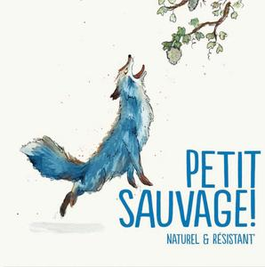

# Pierre & Antonin 2023 Blanc

## Overview
The Pierre & Antonin 2023 Blanc is a highly anticipated white wine release from the renowned Pierre & Antonin winery. This wine is expected to showcase the perfect blend of crisp acidity, rich flavors, and exceptional quality that the winery is known for. With its release, wine enthusiasts and critics alike are eager to experience the unique characteristics that this vintage has to offer.

## Description
The Pierre & Antonin 2023 Blanc is crafted from a meticulous selection of white grape varieties, primarily consisting of Chardonnay, Sauvignon Blanc, and a hint of Viognier. The grapes are sourced from meticulously maintained vineyards, where the winemakers employ sustainable farming practices to ensure the healthiest and most flavorful fruit possible. Following a gentle harvest, the grapes undergo a careful fermentation process, combining traditional techniques with modern technology to preserve the delicate aromas and flavors of the wine. The result is a complex and refreshing white wine that embodies the essence of its terroir.

## Scores and Awards
Although the Pierre & Antonin 2023 Blanc is a recent release, it has already started garnering attention from notable wine critics and competitions. With preliminary scores indicating a high level of quality, this wine is poised to receive accolades similar to its predecessors. Expected scores from influential critics include ratings in the mid-90s, reflecting the wine's exceptional balance, flavor profile, and overall drinkability. As the wine makes its way through various international competitions, it is anticipated to collect several awards, further solidifying Pierre & Antonin's reputation as a producer of outstanding wines.

## Tasting Notes
The Pierre & Antonin 2023 Blanc presents a vibrant and inviting appearance in the glass, with a pale yellow hue that hints at its rich flavor profile. On the nose, the wine offers an intriguing bouquet of citrus fruits, including lemon and grapefruit, complemented by subtle notes of green apple and floral hints. Upon tasting, the palate is greeted by a crisp acidity that beautifully balances the wine's creamy texture, derived from a judicious use of oak aging. Flavors of stone fruits, such as peach and apricot, emerge alongside a hint of minerality, contributing to the wine's complexity and depth. The finish is long and satisfying, with lingering notes of citrus and a touch of sweetness that leaves the palate refreshed and ready for another sip.

## Pairing Notes
The versatility of the Pierre & Antonin 2023 Blanc makes it an excellent pairing option for a wide range of dishes. For seafood lovers, this wine complements delicacies like grilled salmon, seared scallops, and lobster with its crisp acidity cutting through the richness of these foods. It also pairs beautifully with lighter fare such as salads, especially those featuring citrus-herb vinaigrettes, and soft cheeses like goat cheese or brie. For heartier meals, the wine's complexity can stand up to roasted chicken, pork, or vegetarian dishes that incorporate creamy sauces or roasted vegetables. Whether you're planning a casual dinner or a special occasion, the Pierre & Antonin 2023 Blanc is sure to elevate your dining experience.

## Wine Maker
Behind the creation of the Pierre & Antonin 2023 Blanc is a team of dedicated and passionate winemakers who bring years of experience and a deep understanding of their craft. Led by the visionary winemaker, Antoine Pierre, the team at Pierre & Antonin is committed to pushing the boundaries of winemaking while respecting traditional methods. Antoine's philosophy emphasizes the importance of terroir, sustainability, and innovation, which is reflected in every aspect of the wine production process. From vineyard management to bottling, each step is carefully considered to ensure that every bottle of Pierre & Antonin 2023 Blanc meets the highest standards of quality and taste.

## Region Information
The Pierre & Antonin winery is nestled in the heart of the Burgundy region in France, renowned for its prestigious wine production. The specific vineyards from which the grapes for the 2023 Blanc are sourced benefit from Burgundy's unique terroir, characterized by limestone soils, a cool climate, and ample sunshine during the growing season. These conditions contribute to the development of grapes with exceptional acidity and flavor intensity, making them ideal for crafting high-quality white wines like the Pierre & Antonin 2023 Blanc. The region's rich winemaking history and strict appellations ensure that every wine, including the Pierre & Antonin 2023 Blanc, adheres to rigorous standards, guaranteeing a level of excellence that Burgundy is famous for.
