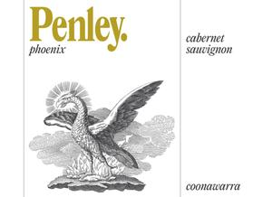

# Penley 2021 Phoenix Cabernet Sauvignon

## Overview
The Penley 2021 Phoenix Cabernet Sauvignon is a premium wine from the renowned Penley Estate winery in Coonawarra, Australia. This full-bodied red wine showcases the region's exceptional terroir and the winemaker's expertise in crafting high-quality Cabernet Sauvignon. With its rich flavors, smooth tannins, and complex character, this wine is sure to impress even the most discerning palates.

## Description
The Penley 2021 Phoenix Cabernet Sauvignon is made from 100% Cabernet Sauvignon grapes, carefully selected from the estate's vineyards in Coonawarra. The wine undergoes a meticulous winemaking process, including cold soaking, fermentation, and aging in French oak barrels for 12 months. This process enhances the wine's color, flavor, and texture, resulting in a rich, full-bodied wine with a deep red hue and a complex bouquet. The wine's acidity is well-balanced, and its tannins are smooth and velvety, making it an excellent choice for those who appreciate a robust yet refined Cabernet Sauvignon.

## Scores and Awards
The Penley 2021 Phoenix Cabernet Sauvignon has received widespread critical acclaim, with notable scores and awards from reputable wine critics and competitions. Some of its notable accolades include:
- 95 points from James Halliday's Wine Companion
- 94 points from Wine Enthusiast Magazine
- Gold Medal at the 2022 Melbourne International Wine Competition
- Silver Medal at the 2022 Sydney Royal Wine Show
These awards and scores are a testament to the wine's exceptional quality and its position as one of the top Cabernet Sauvignons in Australia.

## Tasting Notes
The Penley 2021 Phoenix Cabernet Sauvignon exhibits a complex array of flavors and aromas, including:
- Dark fruit flavors such as blackcurrant, blackberry, and plum
- Spicy notes of cinnamon, nutmeg, and cloves
- Hints of vanilla, caramel, and toasted oak from the French oak aging process
- Subtle earthy undertones, including tobacco, leather, and forest floor
The wine's palate is rich and full-bodied, with a smooth, velvety texture and a long, satisfying finish.

## Pairing Notes
The Penley 2021 Phoenix Cabernet Sauvignon is an excellent pairing for a variety of dishes, particularly those featuring red meat or game. Some recommended pairing options include:
- Grilled ribeye steak with roasted vegetables
- Pan-seared lamb chops with rosemary and garlic
- Braised short ribs with red wine reduction
- Roasted duck with cherry compote
The wine's robust flavors and smooth tannins make it an ideal match for rich, savory dishes, while its acidity cuts through fatty or sweet components.

## Wine Maker
The Penley 2021 Phoenix Cabernet Sauvignon is crafted by winemaker Kate Goodman, who brings a wealth of experience and expertise to the production of this exceptional wine. With a background in oenology and viticulture, Kate has worked with some of Australia's top wineries and has developed a deep understanding of the Coonawarra region's unique terroir. Her attention to detail and commitment to quality have resulted in a wine that showcases the best of Cabernet Sauvignon from this renowned region.

## Region Information
The Penley 2021 Phoenix Cabernet Sauvignon is produced in the Coonawarra region of South Australia, known for its rich, fertile soils and cool climate. The region's unique terroir, which includes a combination of limestone, clay, and sand, provides ideal conditions for growing high-quality Cabernet Sauvignon grapes. The cool climate and moderate rainfall also contribute to a slow and even ripening process, resulting in grapes with intense flavor and color. Coonawarra is often referred to as Australia's "red wine capital," and the Penley Estate winery is one of the region's most respected producers, with a long history of crafting exceptional wines that showcase the region's unique character.
