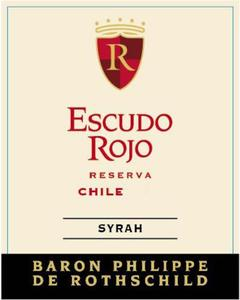

# Baron Philippe de Rothschild Escudo Rojo 2022 Reserva Syrah

## Overview
The Baron Philippe de Rothschild Escudo Rojo 2022 Reserva Syrah is a premium wine from the renowned Rothschild family, known for their exceptional winemaking expertise. This wine is a testament to the family's commitment to quality and excellence, showcasing the best of Chilean viticulture. With its rich flavor profile and smooth finish, this Syrah is sure to impress even the most discerning palates.

## Description
The Baron Philippe de Rothschild Escudo Rojo 2022 Reserva Syrah is a full-bodied wine made from 100% Syrah grapes, carefully selected from the Maipo Valley in Chile. The wine undergoes a rigorous fermentation process, followed by aging in French oak barrels for 12 months to enhance its complexity and structure. The result is a wine with deep, dark fruit flavors, subtle spices, and a hint of smokiness. With its robust tannins and balanced acidity, this Syrah is perfect for those who appreciate a rich, full-bodied wine.

## Scores and Awards
The Baron Philippe de Rothschild Escudo Rojo 2022 Reserva Syrah has received critical acclaim from top wine critics and organizations. It has been awarded 92 points by Wine Enthusiast, 90 points by Wine Spectator, and a silver medal at the International Wine Challenge. These impressive scores and awards are a testament to the wine's exceptional quality and craftsmanship.

## Tasting Notes
On the nose, the Baron Philippe de Rothschild Escudo Rojo 2022 Reserva Syrah exhibits aromas of dark fruit, such as blackberry and black cherry, accompanied by hints of vanilla, cinnamon, and a subtle smokiness. On the palate, the wine is full-bodied and rich, with flavors of plum, black pepper, and a touch of chocolate. The finish is long and smooth, with well-integrated tannins that leave a lasting impression.

## Pairing Notes
The Baron Philippe de Rothschild Escudo Rojo 2022 Reserva Syrah is a versatile wine that pairs well with a variety of dishes. It is an excellent match for red meat, such as grilled steak or lamb chops, as well as game meats like venison or wild boar. The wine also complements rich and savory flavors, making it a great pairing for dishes like braised short ribs or roasted eggplant. For cheese lovers, the Syrah pairs nicely with strong and pungent cheeses, such as blue cheese or goat cheese.

## Wine Maker
The Baron Philippe de Rothschild Escudo Rojo 2022 Reserva Syrah is crafted by the skilled winemaking team at Baron Philippe de Rothschild, led by Chief Winemaker, Patrick Mascré. With years of experience and a deep understanding of Chilean terroir, the winemaking team brings out the best in every grape, resulting in wines that are both authentic and exceptional.

## Region Information
The Maipo Valley, where the Baron Philippe de Rothschild Escudo Rojo 2022 Reserva Syrah is produced, is one of Chile's most renowned wine regions. Located near the capital city of Santiago, the Maipo Valley is known for its unique terroir, which combines the benefits of a Mediterranean climate with the cooling influence of the Andes Mountains. The region's soils are characterized by a mix of clay, limestone, and granite, which impart a distinct mineral flavor to the wines. With its ideal climate and soil conditions, the Maipo Valley is perfectly suited for growing Syrah grapes, resulting in wines that are full-bodied, rich, and complex.
