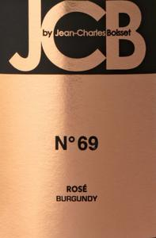

# JCB No. 69 Brut Rosé Crémant de Bourgogne

## Overview
The JCB No. 69 Brut Rosé Crémant de Bourgogne is a luxurious and elegant sparkling wine produced by Jean-Charles Boisset, a renowned French vintner. This exquisite rosé is part of the JCB collection, which showcases the perfect blend of traditional winemaking techniques and modern style. With its delicate pink hue and intricate packaging, this wine is sure to impress even the most discerning palates.

## Description
The JCB No. 69 Brut Rosé Crémant de Bourgogne is made from a blend of Pinot Noir and Chardonnay grapes, carefully selected from the prestigious Burgundy region in France. The wine undergoes a rigorous process of traditional winemaking, including hand-harvesting, gentle pressing, and secondary fermentation in the bottle. The result is a delicate and refined rosé with a subtle effervescence and a rich, fruity flavor profile. The wine is aged for a minimum of 12 months on the lees, which adds complexity and depth to its character.

## Scores and Awards
The JCB No. 69 Brut Rosé Crémant de Bourgogne has received widespread critical acclaim, with numerous awards and accolades from prestigious wine competitions and publications. Some notable scores include:
* 92 points from Wine Enthusiast Magazine
* 90 points from Wine Spectator
* Gold Medal at the San Francisco International Wine Competition
* Bronze Medal at the Decanter World Wine Awards

## Tasting Notes
On the nose, the JCB No. 69 Brut Rosé Crémant de Bourgogne offers a delicate and alluring bouquet of fresh strawberries, raspberries, and rose petals. The palate is equally impressive, with flavors of juicy red fruit, citrus zest, and subtle hints of toast and biscuit. The wine's acidity is crisp and refreshing, while its finish is long and satisfying, with a subtle hint of sweetness.

## Pairing Notes
The JCB No. 69 Brut Rosé Crémant de Bourgogne is an incredibly versatile wine that can be paired with a wide range of dishes, from appetizers to desserts. Some suggested pairing options include:
* Fresh seafood, such as oysters or salmon
* Delicate cheeses, such as brie or goat cheese
* Fruit-based desserts, such as strawberry tart or raspberry sorbet
* Rich and savory dishes, such as roasted chicken or pork tenderloin

## Wine Maker
Jean-Charles Boisset is a French vintner and entrepreneur who has been instrumental in shaping the modern wine industry. With a passion for innovation and a commitment to quality, Boisset has created a range of luxurious and sophisticated wines that are enjoyed around the world. Under his guidance, the JCB collection has become synonymous with elegance, refinement, and exceptional winemaking.

## Region Information
The Burgundy region in France is renowned for its rich wine-making heritage and exceptional terroir. The region's unique combination of limestone soils, cool climate, and meticulous viticulture practices makes it the perfect place to grow high-quality Pinot Noir and Chardonnay grapes. The Crémant de Bourgogne appellation, in particular, is known for producing some of the world's most exquisite sparkling wines, with a focus on traditional winemaking techniques and rigorous quality control. The JCB No. 69 Brut Rosé Crémant de Bourgogne is a perfect representation of this region's exceptional wine-making capabilities.
