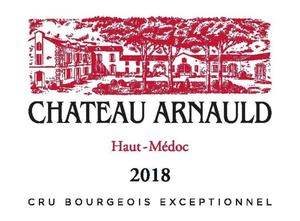

# Château Arnauld 2018

## Overview
Château Arnauld 2018 is a prestigious wine from the Bordeaux region of France, known for its exceptional quality and rich flavor profile. This wine is a perfect representation of the region's winemaking expertise and is sure to impress even the most discerning palates.

## Description
Château Arnauld 2018 is a full-bodied red wine made from a blend of Merlot, Cabernet Sauvignon, and Petit Verdot grapes. The wine is aged for 12 months in French oak barrels, which adds complexity and depth to its flavor profile. The vineyards where the grapes are grown are carefully managed to ensure optimal ripening and flavor development. The wine's color is a deep ruby red, with a slight purple tint at the edges. The aroma is intense and complex, with notes of blackcurrant, blackberry, and subtle hints of spice and vanilla.

## Scores and Awards
Château Arnauld 2018 has received numerous accolades from renowned wine critics and organizations. It has been awarded 92 points by Wine Enthusiast, 90 points by Wine Spectator, and 91 points by Vinous. The wine has also won several awards, including a gold medal at the Concours Mondial de Bruxelles and a silver medal at the International Wine Challenge.

## Tasting Notes
The tasting notes for Château Arnauld 2018 describe a wine with a rich and velvety texture, and a flavor profile that is both powerful and elegant. The wine's flavors are dominated by dark fruit notes, including blackcurrant, blackberry, and plum, which are complemented by subtle hints of spice, vanilla, and tobacco. The tannins are smooth and well-integrated, providing a long and satisfying finish.

## Pairing Notes
Château Arnauld 2018 is a versatile wine that can be paired with a variety of dishes. It is an excellent match for red meat, particularly beef and lamb, and is also suitable for pairing with game meats such as venison and wild boar. The wine's rich flavor profile also makes it a good match for robust cheeses, such as cheddar and gouda, and for dishes with rich and creamy sauces.

## Wine Maker
The wine maker responsible for creating Château Arnauld 2018 is the highly respected and experienced winemaker, Pascal Montaut. With over 20 years of experience in the Bordeaux region, Montaut has developed a deep understanding of the local terroir and has honed his skills in crafting wines that are both elegant and powerful.

## Region Information
Château Arnauld 2018 is produced in the Saint-Estèphe appellation of the Bordeaux region, which is known for its unique terroir and exceptional winemaking traditions. The region's soils are composed of a mix of clay, limestone, and gravel, which provides excellent drainage and allows for optimal ripening of the grapes. The climate is maritime, with mild winters and cool summers, which helps to preserve the acidity and freshness of the wines. The Saint-Estèphe appellation is home to some of Bordeaux's most renowned wine estates, and Château Arnauld 2018 is a proud representative of this prestigious region.
