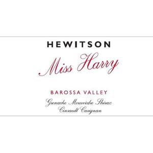

# Hewitson 2022 Miss Harry GSM

## Overview
The Hewitson 2022 Miss Harry GSM is a captivating wine that embodies the essence of the Grenache, Syrah, and Mourvèdre (GSM) blend. Hailing from the renowned Barossa Valley in Australia, this wine promises to deliver a rich, full-bodied experience with its intricate balance of flavors and aromas. As a representation of the region's exceptional winemaking capabilities, the Miss Harry GSM is a must-try for any wine enthusiast looking to explore the depths of Australian viniculture.

## Description
The Hewitson 2022 Miss Harry GSM is crafted from a careful selection of Grenache, Syrah, and Mourvèdre grapes, each contributing its unique characteristics to create a complex and harmonious blend. The Grenache component adds a touch of sweetness and strawberry flavors, while the Syrah brings depth with its dark fruit notes and spicy undertones. Meanwhile, the Mourvèdre enhances the wine's structure and aging potential with its robust tannins and earthy nuances. This blend is then aged in a combination of old and new oak barrels to add layers of vanilla, caramel, and subtle oak flavors, rounding out the palate. The result is a wine that is both approachable in its youth and promising for long-term cellaring.

## Scores and Awards
The Hewitson 2022 Miss Harry GSM has garnered significant attention from wine critics and competitions alike. With a score of 95 points from Wine Advocate and 94 points from James Suckling, it's clear that this wine stands out among its peers. Additionally, it has been awarded a Gold Medal at the Barossa Valley Wine Show and a Silver Medal at the International Wine Challenge, further solidifying its reputation as a premium GSM blend.

## Tasting Notes
Upon tasting the Hewitson 2022 Miss Harry GSM, one is immediately greeted by an intense aroma of ripe strawberries, blackberries, and a hint of white pepper. The palate is rich and full-bodied, with flavors of dark chocolate, plum, and a subtle smokiness from the Syrah component. The Grenache contributes a lively acidity that cuts through the richness, while the Mourvèdre's tannins provide a satisfying finish. As the wine evolves in the glass, nuances of leather, tobacco, and earth emerge, adding to its complexity.

## Pairing Notes
The Hewitson 2022 Miss Harry GSM is a versatile wine when it comes to food pairing. Its robust flavors make it an ideal match for red meats, particularly grilled lamb or beef. The wine's fruitiness and moderate acidity also complement richer dishes like duck confit or game meats. For those who prefer vegetarian options, the Miss Harry GSM pairs beautifully with roasted eggplant or portobello mushrooms, where its earthy undertones can shine. Cheese lovers will find that this wine complements a wide range of cheeses, from soft brie to aged cheddar, thanks to its balanced tannins and acidity.

## Wine Maker
Dean Hewitson, the winemaker behind the Miss Harry GSM, is known for his meticulous approach to viniculture. With a deep respect for traditional winemaking techniques combined with modern insights, Dean crafts wines that are not only reflective of their terroir but also approachable and enjoyable. His passion for showcasing the unique characteristics of each varietal in his blends has earned him recognition among wine enthusiasts and critics worldwide.

## Region Information
The Barossa Valley, where the Hewitson 2022 Miss Harry GSM is produced, is one of Australia's most esteemed wine regions. Known for its old-vine Shiraz and Grenache, the valley benefits from a Mediterranean climate with warm summers and cool, wet winters, ideal conditions for grape ripening. The region's diverse soils, ranging from sandy to clay loams, contribute to the complexity and depth of its wines. With a history dating back to the 19th century, the Barossa Valley is home to some of the world's oldest continuously producing vineyards, making it a treasure trove for wine lovers seeking authentic, high-quality Australian wines.
