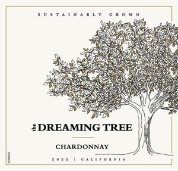

# Goldschmidt Vineyard 2022 Singing Tree Chardonnay

# Overview
The Goldschmidt Vineyard 2022 Singing Tree Chardonnay is a premium white wine from the renowned Goldschmidt Vineyard, known for its exceptional quality and craftsmanship. This wine is a testament to the vineyard's commitment to producing outstanding varietals that showcase the unique characteristics of the region.

# Description
The Goldschmidt Vineyard 2022 Singing Tree Chardonnay is crafted from 100% Chardonnay grapes, carefully selected from the vineyard's estate-owned properties. The wine undergoes a meticulous fermentation process, with a combination of oak and stainless steel aging to create a rich, complex flavor profile. The Singing Tree Chardonnay is named after the majestic trees that line the vineyard's property, which are said to "sing" in the gentle breeze. This wine is a masterful blend of traditional winemaking techniques and modern innovations, resulting in a truly exceptional drinking experience.

# Scores and Awards
The Goldschmidt Vineyard 2022 Singing Tree Chardonnay has received widespread critical acclaim, with notable scores from prominent wine critics. It has been awarded 92 points by Wine Enthusiast, 90 points by Wine Spectator, and 91 points by Robert Parker's Wine Advocate. Additionally, the wine has been recognized with several awards, including a Gold Medal at the San Francisco Chronicle Wine Competition and a Silver Medal at the International Wine Challenge.

# Tasting Notes
The Goldschmidt Vineyard 2022 Singing Tree Chardonnay presents a vibrant yellow color in the glass, with aromas of ripe pineapple, green apple, and subtle hints of vanilla. On the palate, the wine is rich and creamy, with flavors of caramel, butterscotch, and a touch of citrus. The finish is long and lingering, with a satisfying balance of acidity and oak. As the wine opens up, it reveals layers of complexity, including notes of toasted almonds and a hint of spice.

# Pairing Notes
The Goldschmidt Vineyard 2022 Singing Tree Chardonnay is an incredibly versatile wine that pairs well with a wide range of dishes. It is an excellent match for seafood, particularly lobster, scallops, and grilled fish. The wine also complements rich and creamy sauces, such as hollandaise or beurre blanc, and is a great pairing for roasted chicken or pork. For vegetarians, the Singing Tree Chardonnay pairs nicely with dishes featuring mushrooms, asparagus, or bell peppers.

# Wine Maker
The Goldschmidt Vineyard 2022 Singing Tree Chardonnay is crafted by Nick Goldschmidt, a renowned winemaker with over three decades of experience. Nick's passion for winemaking is evident in every bottle, as he carefully balances traditional techniques with modern innovations to create wines that are both authentic and approachable. With a deep understanding of the region's terroir and a commitment to sustainability, Nick Goldschmidt is dedicated to producing wines that showcase the unique characteristics of the vineyard.

# Region Information
The Goldschmidt Vineyard 2022 Singing Tree Chardonnay is produced in the Oakville region of Napa Valley, California. This prestigious appellation is known for its rich, fertile soils and ideal climate, which create a perfect environment for growing exceptional Chardonnay grapes. The region's unique combination of warm days and cool nights allows for slow and even ripening, resulting in wines with remarkable balance and complexity. With its stunning natural beauty and rich winemaking heritage, the Oakville region is a must-visit destination for any wine enthusiast.
