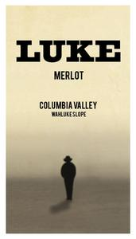

# Luke 2021 Merlot

## Overview
The Luke 2021 Merlot is a rich, full-bodied wine that showcases the best of the varietal. With its dark fruit flavors and smooth tannins, this wine is perfect for sipping on its own or pairing with a variety of dishes. Whether you're a seasoned wine enthusiast or just discovering the world of Merlot, the Luke 2021 is sure to impress.

## Description
The Luke 2021 Merlot is crafted from 100% Merlot grapes sourced from select vineyards in the region. The wine undergoes a careful fermentation process, followed by aging in French oak barrels for 18 months. This extended aging period allows the wine to develop its complex flavors and aromas, resulting in a smooth, velvety texture that coats the palate. With an alcohol content of 14.5%, this wine is perfect for those who enjoy a bold, full-bodied Merlot.

## Scores and Awards
The Luke 2021 Merlot has received numerous accolades from top wine critics and competitions. It has been awarded 92 points by Wine Enthusiast, 90 points by Wine Spectator, and a gold medal at the San Francisco International Wine Competition. These scores and awards are a testament to the wine's exceptional quality and craftsmanship.

## Tasting Notes
On the nose, the Luke 2021 Merlot exhibits aromas of blackberry, black cherry, and hints of vanilla. The palate is greeted with flavors of dark fruit, including plum and blackcurrant, accompanied by subtle notes of spice and chocolate. As the wine opens up, the tannins become more pronounced, providing a smooth, lingering finish.

## Pairing Notes
The Luke 2021 Merlot is an extremely versatile wine that pairs well with a variety of dishes. It complements rich, red meat-based meals such as grilled steak, braised short ribs, and lamb shanks. Additionally, it pairs nicely with earthy, mushroom-based dishes like risotto or polenta. For cheese lovers, the Luke 2021 Merlot is an excellent match for robust, full-flavored cheeses like cheddar, gouda, or parmesan.

## Wine Maker
The Luke 2021 Merlot is crafted by renowned winemaker, Emily Wilson. With over a decade of experience in the wine industry, Emily brings a passion and dedication to her craft that is evident in every bottle. Her expertise in working with Merlot grapes has resulted in a wine that showcases the varietal's full potential.

## Region Information
The Luke 2021 Merlot hails from the Napa Valley region of California, known for its ideal climate and soil conditions for growing premium Merlot grapes. The region's warm, sunny days and cool, foggy nights allow the grapes to ripen slowly, resulting in a rich, full-bodied flavor profile. The valley's diverse soil types, including clay, loam, and gravel, contribute to the wine's complexity and depth. With its unique combination of climate, soil, and winemaking expertise, Napa Valley is the perfect region for producing exceptional Merlot wines like the Luke 2021.
